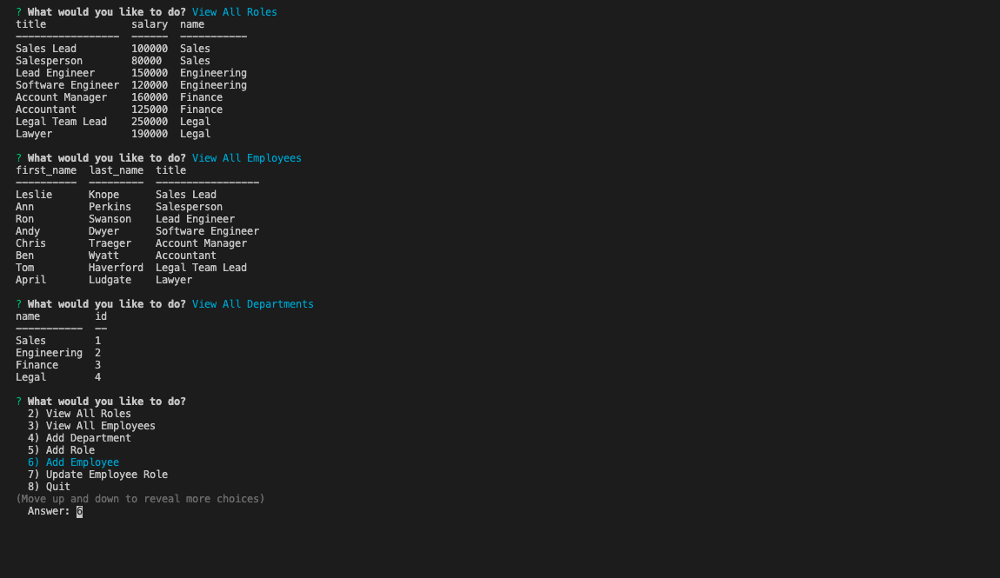

# Employee-Management-System

## Description

The Employee-Management-System provides a solution for managing a company's employees and their position using node, inquirer, and MySQL. This command-line application provides a list of prompts that allow users to update and manipulate the employee database.

## Installations

npm i
Node.js is necessary to run this application. It is recommended that users copy the package.json file when initializing the npm.

## Usage

- add departments, roles, and employees
- view departments, roles, and employees
- update employee roles

## Appearance and Schema

## Demo video

